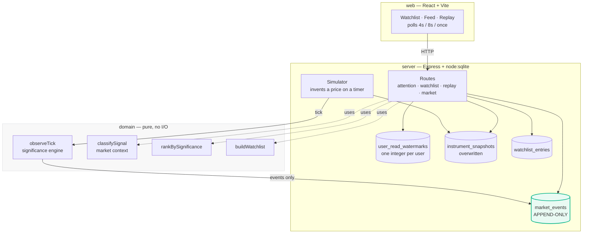

# Market Pulse

> **A price can return to where it started while something important happened in between.**

A smart market watchlist that answers *"what meaningfully changed since I last
checked?"* — per user, from where **you** last looked, so two people opening it
at the same instant see different things.

```bash
npm install && npm run db:seed && npm run dev     # http://localhost:5173
```

Node ≥ 22.5. No database server, no container, no API key, no native build step.

### Where to look

| If you are looking for | Go to |
| --- | --- |
| **Architecture**, and the boundaries it enforces | [Architecture](#architecture) · [ARCHITECTURE.md](ARCHITECTURE.md) |
| **Correctness & reliability** — what is guaranteed, and how | [Guarantees](#the-guarantees-and-how-each-one-holds) |
| **Race conditions & data integrity** | [Guarantees](#the-guarantees-and-how-each-one-holds) — rows 3 and 4 |
| **Scalability**, with measured numbers | [Scale](#what-happens-when-this-gets-big) |
| **Failure handling & unreliable data** | [When things go wrong](#when-things-go-wrong) |
| **Problem interpretation** — why this and not the obvious watchlist | [The problem](#the-problem) · [Not a hypothetical](#this-is-not-a-hypothetical) |
| **Simplicity** — what was deliberately *not* built | [CUT_LIST.md](CUT_LIST.md) |
| **Trade-offs and known limits**, stated plainly | [Trade-offs](#trade-offs-and-known-limitations) |
| A 60-second tour of the running app | [Walkthrough](#a-60-second-walkthrough) |

## The problem

A watchlist compares the current price against the last snapshot it showed you.
That answers one question well — *where does this stand?* — and silently discards
everything that happened along the way.

Consider a stock you last looked at when it was ₹2,900.

```
        ₹2,900 ─────────────────────────────────── ₹2,900
              ╲                              ╱
               ╲        ₹2,639              ╱
                ╲──────────────────────────╱
                       you were away
```

You come back. A traditional watchlist tells you:

```
RELIANCE   ₹2,900   0.00%
```

That is **true**, and it is **useless**. It fell 9% and recovered 9.89% while you
were gone, and the interface has no way to say so — because it never kept the
middle.

## The idea

Two kinds of information, deliberately kept apart:

> **State** tells you where the market *is*.
> **Events** tell you what *happened*.

A traditional watchlist stores only the first. Market Pulse stores both, and
answers a question a snapshot cannot:

> *"What happened while I was away, and why did it matter?"*

Because the answer depends on when *you* last looked, two people opening the app
at the same moment see different things.

## This is not a hypothetical

The round trip this product is built around is a documented market phenomenon,
not a scenario invented to make a demo work.

**Prices really do leave and come back.** Baltussen, Da and Soebhag
([*End-of-Day Reversal*, 2024](https://papers.ssrn.com/sol3/papers.cfm?abstract_id=5039009))
find that individual stocks show sharp intraday return reversals in the last
thirty minutes of trading, driven *primarily by intraday losers recovering*.
A day's change is measured open to close, so it is structurally blind to exactly
the move that is most likely to have happened.

**And the usual fix makes it worse.** Alerting is the standard answer to "tell
me what I missed", and alert fatigue is the most commonly cited reason traders
abandon alerting systems: after a few ignored notifications you have trained
yourself to dismiss all of them, including the one that mattered. The
practitioner advice is to alert on *meaningful* thresholds, "not every 1% move".

So Market Pulse **never interrupts you**. The significance rule is the filter —
5% from a moving anchor — and everything that clears it accumulates in an
append-only log until you come back. Not notifying is the design, not a gap in
it.

What this system does *not* yet do is size that threshold to each instrument's
own volatility, which is where the same practitioner advice points next. That
limitation is real and is listed below rather than papered over.

## The product model

Four concepts, each answering a different question. They are not the same list,
and that is the point.

| | Answers | Example |
| --- | --- | --- |
| **Watchlist** | What do I care about? | 12 instruments, RELIANCE to ITC |
| **Snapshots** | What do we currently know? | RELIANCE, as recorded at 2:15 PM |
| **Event log** | What meaningfully happened? | RELIANCE fell 9%, then recovered |
| **Attention feed** | What changed since *I* last checked? | 9 instruments — not TCS |
| **Replay** | What happened along the way? | ₹2,900 → ₹2,639 → ₹2,900 |

TCS sits on the watchlist and appears nowhere in the feed. It never crossed the
significance threshold, so there is nothing to report — and it still belongs on
the list, because a watchlist is what you care about, not only what changed.

## Architecture

Three packages. `domain` is pure TypeScript with **no dependencies at all** — no
framework, no `node:` built-in, not even a clock. `server` and `web` both depend
on it and never on each other. This is enforced by ESLint, not by convention: a
`node:fs` import inside `domain` fails `npm run lint`.



**The load-bearing idea is the split between the two kinds of storage.**

| Table | Nature | Rule |
| --- | --- | --- |
| `market_events` | History | Append-only. Never mutated, never deleted. |
| `instrument_snapshots` | Knowledge | Overwritten as we learn. Makes no claim about the past. |
| `user_read_watermarks` | Position | One integer per user. Monotonic. |
| `watchlist_entries` | Interest | Per user, freely added and removed. |

A traditional watchlist stores only the second row. Storing the first is what
makes "what did I miss" answerable at all — and storing the third is what makes
the answer *yours* rather than everyone's.

Note what the simulator is **not** given: a `WatermarkStore`. A running market
therefore cannot consume anyone's unread events, because it has no way to
address one.

### The guarantees, and how each one holds

The distinction that matters: some of these are enforced by a test, and some are
enforced by the code *lacking the ability* to violate them.

| # | Guarantee | How it is enforced |
| --- | --- | --- |
| 1 | **History is append-only** | Three ways: the store exposes no `update`/`delete`, the type has no mutating operation, and SQLite `BEFORE UPDATE`/`BEFORE DELETE` triggers abort it. A deletion forced into the request path during testing did not fail — it *could not execute*. |
| 2 | **Reading never acknowledges** | `GET /attention-feed` performs no write. A refresh, a prefetch or a second tab cannot silently consume events you never saw. |
| 3 | **A read position never moves backwards** — *race condition* | `last_read_sequence = MAX(excluded.last_read_sequence, last_read_sequence)` **inside the upsert**. Read-then-write in TypeScript leaves a gap between the read and the write; doing it in the statement leaves none. |
| 4 | **A stale observation never overwrites a newer one** — *race condition* | Same technique in the snapshot upsert, keyed on `observed_at`. A late-arriving reading of an older moment is discarded, not applied. |
| 5 | **One user's reading changes nothing for another** | Events are stored once and referenced by position. There is no per-user copy to diverge. |
| 6 | **Replay cannot advance a read position** | `createReplayRoutes` is handed no `WatermarkStore`, and the request cannot name a user. Structural, not remembered. |
| 7 | **Removing a watchlist entry cannot delete history** | `WatchlistStore` has no access to `market_events`, and the trigger in (1) would abort it anyway. |
| 8 | **The engine is deterministic** | Pure fold over one instrument's ticks. Integer paise, never floating point. Same ticks in, same events out, byte-identical. |

Each has a named test block. Each was **mutation-tested** — broken deliberately
to confirm the matching test fails. A test that has never failed is not known to
work.

### What happens when this gets big

Measured, not asserted. One user following **exactly one instrument**, with only
the size of the shared log changing:

| Event log | `GET /watchlist` | `GET /attention-feed` payload |
| --- | --- | --- |
| 1,000 | 1.9 ms | 19 KB |
| 5,000 | 1.1 ms | 19 KB |
| 20,000 | 1.7 ms | 19 KB |

Both are flat because both reads are **scoped**: the watchlist reads only the
instruments that user follows (`WHERE instrument_id IN (…)`, served by
`idx_market_events_instrument_sequence`), and the feed returns at most 50 ranked
events while its summary counts still cover the whole window.

Before that scoping, the same table read 3.2 / 9.1 / **26.4 ms** and returned
224 KB / 1.1 MB / **4.4 MB**. The cost of rendering one row was proportional to
the size of the entire market's history — which is the kind of thing that only
shows up if you measure it.

The honest remaining limit: the feed's *payload* is bounded, but its
*server-side read* still walks the whole unread window, because the summary
counts must be complete. See [Trade-offs](#trade-offs-and-known-limitations).

### When things go wrong

| Failure | What happens |
| --- | --- |
| A tick arrives out of order | **Rejected**, not reordered or silently accepted — accepting one corrupts history in a way no later read can detect. The generator skips that instrument for that step rather than dying inside its own timer. |
| A poll request fails | The last good reading stays on screen, with the error beside it. A dropped request is not a reason to blank a page someone is reading. |
| A client acknowledges beyond the log head | **Refused with 400**, not clamped. Clamping would advance the watermark over events that were never shown — permanently, since watermarks only move forward. |
| A client acknowledges below its watermark | Accepted as a no-op. It consumes nothing, so it is not an error. |
| A malformed or oversized request body | `400` / `413` as JSON, matching every other error in the API. No stack trace, no filesystem path. |
| The market has nothing to simulate | `409` naming the command to run, rather than reporting success for something that did not happen. |
| Two spellings of one symbol | Stored as given. Case is folded in exactly one place — the benchmark guard — because folding it in *storage* would silently merge two rows. |

## The market keeps moving

Prices update every three seconds while the app is open, and new events appear
as they cross the threshold.

**The prices are generated, not real.** There is no market data feed here. A
simulator invents a price for each instrument on a timer and hands every one of
them to the *same* significance engine the seed and the tests use — so a
generated event is an ordinary event, with the same anchor, the same threshold,
and the same "Why is this significant?" explanation behind it. Inventing prices
is not a second way into history.

The header says so in the server's own words: **Simulated market — new
observations every 3s**. The word *live* appears nowhere in the interface, and a
test asserts it stays out. When the generator is off, the same strip reads
**Static data** and nothing on the page claims to be updating.

**Pause it.** The header has a pause control, so the market can be stopped while
you read a screen and started again to watch events arrive. It stops a timer;
everything already recorded stays exactly as it is.

Three of the twelve instruments — TCS, WIPRO and ITC — are calibrated so calmly
that they never cross the threshold. That is deliberate: the demo needs quiet
instruments to stay quiet, and a test runs two thousand simulated steps to prove
they do.

## Try it

```bash
npm install
npm run db:seed     # 12 followed instruments + 1 benchmark, 20 events, two readers
npm run dev
```

Open **http://localhost:5173**. Requires **Node.js ≥ 22.5** (for the built-in
`node:sqlite` driver). No database server, container, or native build step.

### A 60-second walkthrough

**1 — Start on *My watchlist*.** Twelve instruments, split into **Needs your
attention (9)** and **Quiet (3)**. Watch a price flash as it changes. Note
**TCS** in the quiet group: a recorded price, and *"No meaningful changes"*. It
is quiet, and it is still here.

**2 — Note RELIANCE:** *"2 meaningful changes — net 0.00% overall."* Two things
happened and they cancelled out, which is not the same as nothing happening —
and note that the price on the right is the *latest observation*, a different
moment from the events that line describes. Click **View what happened →**.

**3 — *While you were away*** groups what crossed the threshold by instrument.
Instruments are ordered by their largest move — INFY's genuine 20% fall leads at
seed time — and each instrument's own events run in the order they happened.
Compare **TATAMOTORS**, which only ever *rose*, with **RELIANCE**, which
*recovered*: the wording is derived from the story, never assumed. Notice the
small **Outlier** tag on INFY: every event is also checked against a market
benchmark, so a move that happens to the whole market reads differently from
one that happens to a single stock — see **RELIANCE**, whose decline is tagged
**Market-wide** while its own recovery is tagged **Outlier**, because it
bounced back harder than the index did. Open **Why is this significant?** on
any event to see the anchor, the move, the threshold that fired, and the
market-context verdict spelled out in full — including the quiet majority of
events that are simply specific to the stock and get no tag at all.

**4 — Toggle to *Traditional watchlist*.** Same data, same moment:

```
RELIANCE   ₹2,900.00   0.00%   No change across what you missed
                               now ₹2,893.78 as recorded 8:59 pm
```

Two prices, deliberately. The first is where the events you missed ended; the
second is the latest observation, because the market kept moving after the last
threshold crossing. Both are true, and saying only one of them is how the two
screens quietly came to disagree.

Toggle back. **The price went nowhere. The story did not.**

**5 — Open *Replay*.** It opens on whichever instrument has the most recorded
crossings — ADANIENT at seed time, with five — rather than the largest single
move, because one big event makes a poor thing to step through. The dropdown
lists every instrument that has a story, biggest move first, with the index
marked *(market benchmark)* because it is context rather than something to
follow. **Select RELIANCE**, which is the one that makes the argument.
The shape fills in as you go and the snapshot number moves — 0.00%, then −9.00%,
then back to 0.00% — while the revealed events stay on screen. Watching changes
nothing: not the events, and not your read position.

**6 — Switch users.** In the *Viewing as* box, change `demo` to `priya`. Same
log, same instant, a different answer: `priya` was seeded having already read
two thirds of history, so her feed is shorter. Change it back. Nothing either of
them does moves the other's position.

## Key engineering decisions

The ones that shaped the design, not a list of everything:

**History and knowledge are different, so they are different tables.**
`market_events` is append-only and never overwritten; `instrument_snapshots` is
overwritten as we learn. A snapshot makes no claim about the past. This contrast
is the product thesis at the schema level.

**Append-only is enforced, not intended.** The store exposes no update or delete,
and the database refuses both via triggers. Removing an instrument from a
watchlist cannot delete market history — a deletion forced into the request path
does not fail a test, it *cannot execute*.

**Identity is not ordering.** An event has an `event_id` (which event) and a
`sequence` (where it sits). An auto-increment key supplies both and hides the
distinction. A read position points at a sequence, never an id.

**Reading is not acknowledging.** `GET` never advances your read position; only
an explicit `POST` does. Advancing on read is the natural shortcut and a
correctness bug — a refresh, a prefetch, or a second tab would consume events you
never saw, unrecoverably.

**Read positions only move forward.** Enforced in SQL as
`MAX(incoming, existing)`, so a stale client cannot un-read what you have seen.

**`undefined` is not zero.** A quiet instrument reports *no* net change, not a
net change of zero. "Nothing happened" and "it moved 9% and came back" are
different facts, and collapsing them into `0.00%` is exactly the mistake this
product exists to point out.

**The domain is pure.** Significance, ranking, watermarks and replay are
functions over plain values — no clock, no database, no framework. `domain`
cannot import Express, React, or even a `node:` built-in, and ESLint enforces it.

**Significance and context are separate questions, computed separately.**
Whether a move crosses the threshold is decided by folding one instrument's own
ticks (I3: no other instrument exists to the engine). Whether that move is
specific to the instrument or shared by the whole market is a second, later
step over recorded events, comparing against one benchmark instrument. Keeping
them apart means the engine never needed to change, and the classification
function is simple enough to guarantee — structurally, not by convention — that
it can never judge an event using a benchmark move that hadn't happened yet.

More detail, including what was deliberately *not* built, is in
[ARCHITECTURE.md](ARCHITECTURE.md) and [CUT_LIST.md](CUT_LIST.md).

## Trade-offs and known limitations

Stated plainly, because they affect what the system can honestly claim.

- **A staged move is reported in pieces.** Emission re-anchors, so 2900 → 2726 →
  2639 reports a 6% decline and not the 9% that actually happened. A settle
  window would fix it; it is deferred until the feed shows whether it matters.
- **There is no live market data.** Prices come from a seed script and then a
  simulator: a mean-reverting random walk with a per-instrument volatility, which
  is not a model of anything. Every price is labelled *"as recorded"* and never
  *"live"*, the header says *simulated*, and tests assert those words stay out.
- **The simulator is not ingestion.** It runs in-process on a timer and writes
  directly to the stores. Duplicate ticks, out-of-order arrival across a network,
  backpressure and provider disconnects are all still undecided — see below.
- **Freshness is polled, not pushed.** The client re-reads on a timer (2s for the
  header, 4s for the watchlist, 8s for the feed). A socket would cut latency
  nobody is measuring in exchange for a connection lifecycle to maintain.
- **Quiet instruments show no percentage.** There is no baseline to compute a
  day-change from, so none is shown. The alternative was inventing a number.
- **One benchmark, one threshold for it too.** NIFTY is a single simulated
  instrument, classified by the same 5% rule as everything else — a real
  benchmark comparison would use an index feed and likely a different
  threshold for it, since an index moves less than an individual stock day to
  day. `OUTLIER_FACTOR` (1.5×) is a placeholder in the same spirit as the
  significance threshold: legible for tests, not calibrated against a real
  market.
- **Significance is one threshold (5%).** Not calibrated against real market
  behaviour; volatility-relative significance is a real refinement and is not
  built.
- **No authentication, and that exposes writes, not just reads.** `userId` is a
  query parameter and a text box, so any caller can read *or modify* any
  reader's state — advance someone else's watermark, remove someone else's
  watchlist entry. Because watermarks only move forward, a forged
  acknowledgement is unrecoverable: it permanently marks another person's unread
  events as read. Worth stating plainly rather than as "no auth", which sounds
  like a read-scope simplification. The model is auth-ready — the watermark is
  already keyed by user and enforced monotonic in SQL — so the change is
  middleware that derives `userId` from a session instead of the query string,
  not a redesign. Multiple watchlists would separately widen one primary key.
- **The feed returns a page, and its read is still unbounded.** At most 50 events
  come back per request, most significant first, with the summary counts
  deliberately covering the *whole* unread window so "9 instruments need your
  attention" stays true. The response is therefore constant-size; the
  server-side read is not, because computing those counts still walks the whole
  window. Bounding that too means a SQL aggregate.
- **No ingestion pipeline.** Duplicate ticks, out-of-order arrival, staleness and
  provider disconnects are all undecided, and would be a phase of their own.

## Testing

The suite tests **product invariants**, not implementation details — each has a
named block:

- The **golden scenario**: a price that returns to where it started still
  surfaces what happened in between. It asserts the premise first — that a
  snapshot comparison genuinely reports nothing — so the scenario cannot quietly
  stop proving anything.
- **History is append-only**, at runtime and in the database.
- **Restart persistence**, proved with a real child process that writes the story
  and exits before anything reads it back.
- **Read positions are independent** between users and never move backwards.
- **Reading does not acknowledge**, verified on both the server and the client.
- **The engine is deterministic and pure** — same ticks in, same events out.
- **A running market cannot consume your unread events.** The simulator is handed
  the event and snapshot stores and no watermark store, so there is no call it
  could make; a test runs two thousand steps and asserts the read position has
  not moved.
- **The simulation is reproducible** — seeded PRNG, so the same seed writes the
  same history twice, and a failure can be replayed.
- **A classification cannot see the future.** `classifySignal` may be handed a
  benchmark event recorded after the one being classified; the verdict is
  identical whether that future event is present in the array or not.

These are checked by mutation: the threshold comparison, the anchor,
re-anchoring, log freezing, `MAX` in the watermark upsert and more were each
broken deliberately to confirm the matching tests fail.

```bash
npm test
npm run verify   # format + lint + typecheck + test + build
```

## Commands

| Command | Purpose |
| --- | --- |
| `npm run dev` | API (:4000) and web client (:5173) together |
| `npm run db:seed` | Build the demo data |
| `npm run db:reset` | Delete the local database and reseed |
| `MARKET_SIMULATION=off npm run dev` | Run on seeded data alone, nothing generating |
| `npm test` | Every suite |
| `npm run verify` | The full quality gate |

Seeding refuses to run twice against the same database: history is append-only,
so a second run would append a duplicate story rather than replacing it. Use
`db:reset` to start over.

**Seed before you run.** With an empty database there is nothing to simulate, and
the app says so rather than pretending: the server logs that it has nothing to
generate, and the Resume control answers `409` naming the command to run instead
of silently doing nothing.

`npm run verify` also runs in CI on every push and pull request — see
[.github/workflows/verify.yml](.github/workflows/verify.yml).

## Layout

```
packages/
├── domain/   Pure TypeScript. Significance, log, watermarks, replay,
│             watchlist, and the wire contracts. No I/O of any kind.
├── server/   Express API, SQLite persistence, migrations.
└── web/      React + Vite client.
```

`domain` depends on nothing. `server` and `web` both depend on `domain` and never
on each other — enforced by lint, not convention.
